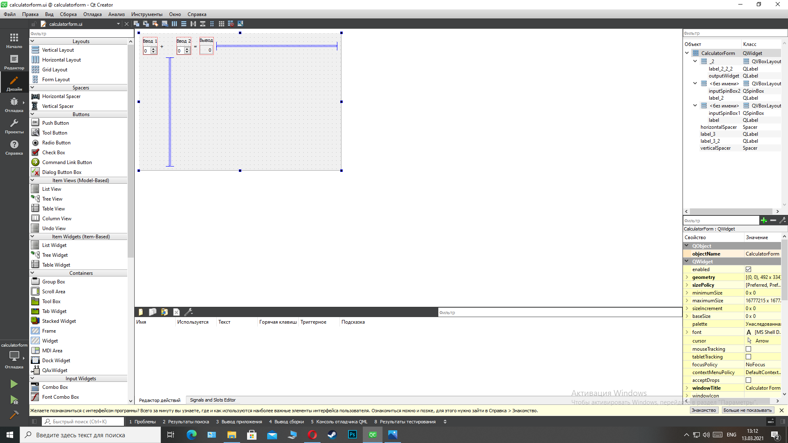
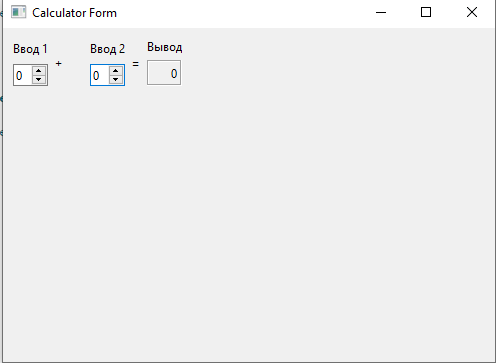

МИНИСТЕРСТВО НАУКИ  И ВЫСШЕГО ОБРАЗОВАНИЯ РОССИЙСКОЙ ФЕДЕРАЦИИ 
Федеральное государственное автономное образовательное учреждение высшего образования 
"КРЫМСКИЙ ФЕДЕРАЛЬНЫЙ УНИВЕРСИТЕТ им. В. И. ВЕРНАДСКОГО" 
ФИЗИКО-ТЕХНИЧЕСКИЙ ИНСТИТУТ 
Кафедра компьютерной инженерии и моделирования

 
<h3 align="center">Отчёт по лабораторной работе № 4  по дисциплине "Программирование"</h3>
  

Студента 1 курса группы ИВТ-б-о-201(2) 
Абляметов Ибраим Асанович 
направления подготовки 09.03.01 "Информатика и вычислительная техника"

  
<table>
<tr><td>Научный руководитель  старший преподаватель кафедры  компьютерной инженерии и моделирования</td>
<td>(оценка)</td>
<td>Чабанов В.В.</td>
</tr>
</table>
  

Симферополь, 2021

## Постановка задачи
Настроить рабочее окружение, для разработки программного обеспечения при помощи Qt и IDE Qt Creator, а также изучить базовые возможности данного фреймворка.

## Выполнение работы

### Задание 1
1.Вначале был скачан QT Creator с официального сайта, а также в процессе установки были выбраны все необходиные компоненты для среды 
2.Был открыт пример **Calculator Form Example**.
3.Дальше последовала настройка проекта, я открыл файл в каталоге Форма и открылся редактор, в редакторе была открыта форма и текст "Input 1", "Input 2", "Output" был измен на "Ввод 1", "Ввод 2" и "Вывод" соответственно.

Рисунок 1. Редактор формы Qt Creator

Рисунок 2. Финальный вид приложения

### Задание 2
**Как изменить цветовую схему (оформление) среды?** 
Инструменты -> Параметры -> Среда -> Интерфейс

**Как закомментировать/раскомментировать блок кода средствами Qt Creator? Имеется ввиду комбинация клавиш или пункт меню.** 
`Ctrl+/`

**Как открыть в проводнике Windows папку с проектом средствами Qt Creator?** 
Я зашел в саму среду и там открыл нужный мне файл

**Какое расширение файла-проекта используется Qt Creator? Может быть несколько ответов.** 
`"Название проекта".pro` для QT 
`CMakeLists.txt` для системы CMake и `*.cmake` для библиотек.

**Как запустить код без отладки?** 
Щелкнуть на знак запуска (зелёный треугольник) слева снизу или `Ctrl+R`

**Как запустить код в режиме отладки?** 
Щелкнуть на знак запуска (зелёный треугольник) с жучком слева снизу

**Как установить/убрать точку останова (breakpoint)?** 
Щелкунуть слева от номера нужной вам строки или кликнуть на нужную вам строку и нажать `F9`

### Задание 3
**Чему равны переменные i и d в 6 строке?** 
d = 0.0 
i = 32767

**Чему равны переменные i и d в 7 строкe?** 
d = 0.0 
i = 5

**Чему равны переменные i и d в 8 строке?** 
d = 5.0 
i = 5

## Задание 4
** Изучено https://www.youtube.com/watch?v=rFdd02Bd4_0&list=PLKssqRhCd4-BPcXUHRo6uDQ6E0BKkkOuc&index=7 и выполнено

## Вывод
Выполняя эту лаборатурную работу я научился:
- Создавать проект, а такжен изучил базовые возможности Qt Creator
- Настраивать среду работы
- Работать с примерами проектов в этом фрейворке
